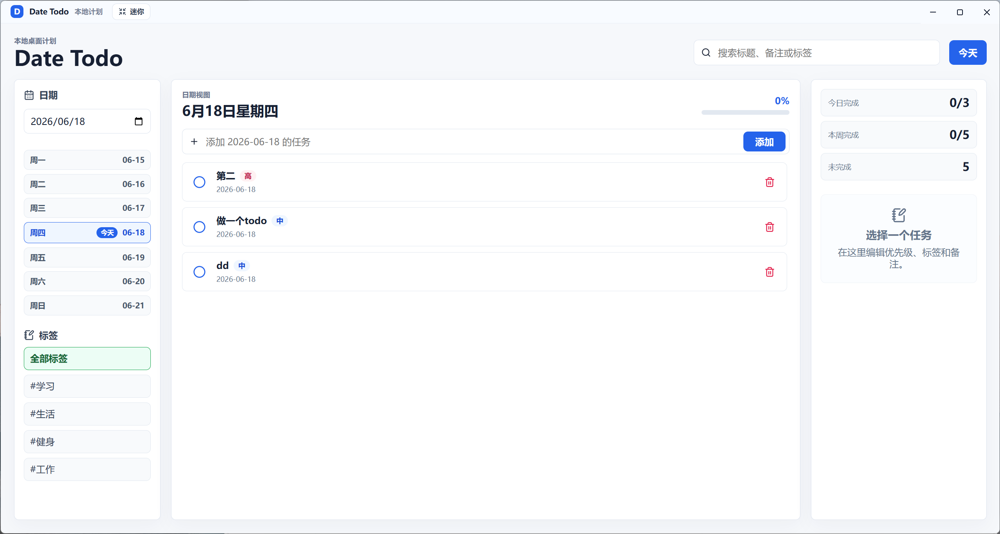

# Date Todo

Date Todo 是一个本地 Windows 桌面 Todo 应用，用来按日期记录每天想做的事情。它适合放在桌面上长期使用：完整模式用于整理任务，迷你模式用于固定在桌面角落随时查看。



## 功能特点

- 按日期管理 Todo，清楚区分今天、过去日期和未来日期
- 过去日期只能查看，不能新增、修改或删除任务
- 今日日期在日期列表中有特殊强调
- 支持任务完成状态、优先级、固定标签和备注
- 标签固定为：学习、生活、健身、工作
- 支持按标题、备注和标签搜索任务
- 支持迷你模式，可缩小并置顶显示在桌面
- 数据保存在本地，不需要登录、不依赖云服务
- 本地数据损坏时会自动备份并尽量恢复可读内容

## 界面设计

Date Todo 使用三栏布局：

- 左侧：日期选择、本周日期和标签筛选
- 中间：当前日期的任务列表和快速新增入口
- 右侧：任务详情、优先级、标签和备注编辑

迷你模式会隐藏侧栏和详情栏，只保留最常用的任务查看与新增能力，适合固定在桌面边缘。

## 技术栈

- Electron
- React
- TypeScript
- Vite / electron-vite
- 本地 JSON 数据存储

## 本地运行

```powershell
npm.cmd install
npm.cmd run dev
```

## 构建

```powershell
npm.cmd run build
```

生成可直接运行的 Windows 程序目录：

```powershell
npm.cmd run dist
```

构建完成后运行：

```powershell
release\win-unpacked\Date Todo.exe
```

## 数据存储

任务数据默认保存在系统应用数据目录中，例如：

```text
C:\Users\<你的用户名>\AppData\Roaming\date-todo-desktop\todos.json
```

应用会通过本地 JSON 文件保存任务，适合个人离线使用。

## 项目状态

这是一个个人桌面 Todo 工具的第一版，已经支持日常任务记录、日期查看、迷你模式和本地保存。后续可以继续加入：

- 正式应用图标
- 安装包版本
- 导出 Markdown / CSV
- 桌面提醒
- 更多统计视图
